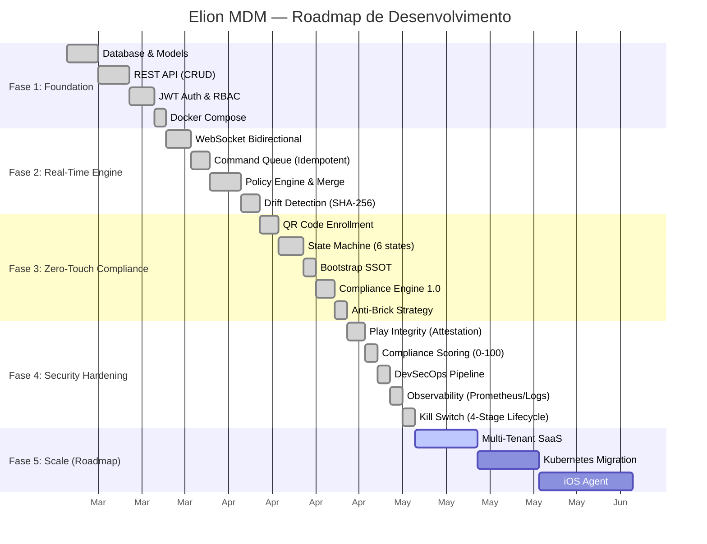
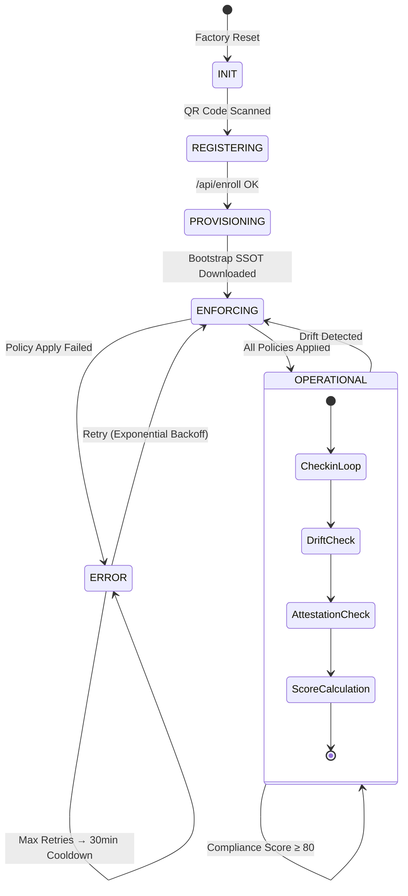

<p align="center">
  <h1 align="center">🛡️ Elion MDM</h1>
  <p align="center">
    <strong>Enterprise Mobile Device Management Platform</strong>
  </p>
  <p align="center">
    Zero-Touch Enrollment · Real-Time Compliance · Hardware-Bound Trust · Self-Healing Architecture
  </p>
  <p align="center">
    
    
    
    
    
    
    
  </p>
</p>

---

## 📋 Índice

- [Visão Geral](#-visão-geral)
- [Arquitetura do Sistema](#-arquitetura-do-sistema)
- [Roadmap de Desenvolvimento](#-roadmap-de-desenvolvimento)
- [Fluxo de Enrollment](#-fluxo-de-enrollment-e-compliance)
- [Backend (FastAPI)](#-backend-fastapi)
- [Android Agent (Kotlin)](#-android-agent-kotlin)
- [Frontend (React + Vite)](#-frontend-react--vite)
- [Infraestrutura](#-infraestrutura)
- [Guia de Deploy](#-guia-de-deploy)
- [Variáveis de Ambiente](#-variáveis-de-ambiente)
- [API Reference](#-api-reference)
- [Pipeline CI/CD](#-pipeline-cicd)
- [Segurança](#-segurança)
- [Melhorias Futuras](#-melhorias-futuras)

---

## 🎯 Visão Geral

O **Elion MDM** é uma plataforma completa de Gerenciamento de Dispositivos Móveis (MDM) de nível enterprise, construída do zero para oferecer controle total sobre frotas de dispositivos Android corporativos.

### O que o Elion MDM faz:

| Capacidade | Descrição |
|---|---|
| 📱 **Enrollment Zero-Touch** | Provisiona dispositivos via QR Code — sem interação manual |
| 🔒 **Modo Kiosk** | Bloqueia o dispositivo em apps específicos com watchdog anti-escape |
| 📡 **Comandos em Tempo Real** | WebSocket bidirecional para LOCK, WIPE, INSTALL com confirmação |
| 🔍 **Drift Detection** | Detecção de desvio de conformidade via SHA-256 hash comparison |
| 🧠 **Self-Healing** | State machine com backoff exponencial previne brick do dispositivo |
| 🛡️ **Hardware Trust** | Play Integrity API para atestação de integridade de hardware |
| 📊 **Compliance Scoring** | Score 0-100 ponderado com enforcement automático |
| 👤 **RBAC Completo** | Controle de acesso baseado em roles com proteção anti-escalação |
| 📈 **Observabilidade** | Logs JSON estruturados + Prometheus metrics + Correlation ID end-to-end |

---

## 🏗️ Arquitetura do Sistema

```
                          ┌─────────────────────────────────┐
                          │      Google Play Integrity API   │
                          └────────────┬────────────────────┘
                                       │ Token Validation
                                       │
┌──────────────┐     ┌────────────────────────────────┐     ┌──────────────────┐
│              │     │         Nginx Reverse Proxy     │     │                  │
│   Android    │◄───►│  TLS · WebSocket Upgrade · LB   │◄───►│  React Dashboard │
│   Agent      │     │  Rate Limiting · Static Files   │     │  (Vite + TS)     │
│   (Kotlin)   │     └────────────┬───────────────────┘     └──────────────────┘
│              │                  │
│  ┌─────────┐ │     ┌────────────▼───────────────────┐
│  │State    │ │     │       FastAPI Backend            │
│  │Machine  │ │     │                                  │
│  ├─────────┤ │     │  ┌──────────┐  ┌──────────────┐ │     ┌──────────────┐
│  │Policy   │ │     │  │MDMService│  │Attestation   │ │     │              │
│  │Manager  │ │     │  │          │  │Service       │─┼────►│    Redis     │
│  ├─────────┤ │     │  ├──────────┤  ├──────────────┤ │     │  Anti-Replay │
│  │Command  │ │     │  │Policy    │  │RBAC          │ │     │  Cache       │
│  │Handler  │ │     │  │Engine    │  │Service       │ │     │  Rate Limit  │
│  ├─────────┤ │     │  ├──────────┤  ├──────────────┤ │     └──────────────┘
│  │Kiosk    │ │     │  │Drift     │  │WebSocket     │ │
│  │Manager  │ │     │  │Detector  │  │Manager       │ │     ┌──────────────┐
│  ├─────────┤ │     │  └──────────┘  └──────────────┘ │     │              │
│  │Attestat.│ │     │                                  │────►│ PostgreSQL   │
│  │Service  │ │     │  Watchdogs: Presence · Commands  │     │  Devices     │
│  └─────────┘ │     │              · Compliance        │     │  Policies    │
│              │     └──────────────────────────────────┘     │  Commands    │
└──────────────┘                                              │  Audit Logs  │
                                                              └──────────────┘
```

### Componentes Principais

| Componente | Tecnologia | Responsabilidade |
|---|---|---|
| **Backend** | FastAPI + SQLAlchemy 2.0 | API REST, WebSocket, Business Logic, Watchdogs |
| **Frontend** | React 18 + Vite + TypeScript | Dashboard administrativo, visualização de telemetria |
| **Android Agent** | Kotlin + Device Owner API | Execução de políticas, compliance local, atestação |
| **PostgreSQL 15** | Alpine | Persistência de dispositivos, políticas, comandos, auditoria |
| **Redis** | In-Memory | Nonces anti-replay, cache de atestação, rate limiting |
| **Nginx** | Alpine | Reverse proxy, WebSocket upgrade, TLS termination |

---

## 🗺️ Roadmap de Desenvolvimento



### Fases Completas

| Fase | Status | Entregas |
|---|---|---|
| **1. Foundation** | ✅ Concluída | Modelos DB, API REST, JWT Auth, Docker, RBAC |
| **2. Real-Time Engine** | ✅ Concluída | WebSocket bidirecional, Command Queue, Policy Engine, Drift Detection |
| **3. Zero-Touch Compliance** | ✅ Concluída | QR Code Enrollment, State Machine, Bootstrap SSOT, Anti-Brick |
| **4. Security Hardening** | ✅ Concluída | Play Integrity, Compliance Scoring, CI/CD Pipeline, Observability, Kill Switch |

---

## 🔄 Fluxo de Enrollment e Compliance



### Passo a Passo Detalhado:

1. **📱 QR Code Scan** — O administrador gera um QR Code no dashboard. O device Android escaneia e recebe: `profile_id`, `bootstrap_secret`, `api_url`.

2. **🤝 Enrollment (`POST /api/enroll`)** — O agent envia seus dados (IMEI, modelo, versão Android). O backend valida o `bootstrap_secret`, cria o registro do device, materializa a política a partir do `ProvisioningProfile` e retorna um `device_token` JWT.

3. **📦 Bootstrap SSOT (`GET /api/devices/{id}/bootstrap`)** — O device baixa o estado completo desejado: políticas, apps permitidos, features bloqueadas e comandos pendentes. Essa é a **Single Source of Truth**.

4. **⚙️ Policy Enforcement** — O `PolicyManager` do Android aplica as regras em ordem determinística: Restrições → Kiosk → Apps → Senha → WiFi. Cada etapa é atômica e reporta sucesso/falha.

5. **✅ OPERATIONAL** — O dispositivo entra no loop principal: check-in periódico, verificação de drift via hash, atestação de hardware e cálculo do Compliance Score.

6. **🔁 Self-Healing** — Se um drift é detectado (hash mismatch), o sistema reenvia automaticamente apenas os subcomandos necessários. Rate limit (10/hora) e anti-loop previnem loops destrutivos.

---

## ⚡ Backend (FastAPI)

### Estrutura de Diretórios

```
backend/
├── main.py                    # Entry point, middleware setup, watchdogs
├── api/
│   ├── routes.py              # Core API (devices, enrollment, attestation)
│   ├── auth.py                # JWT authentication (users)
│   ├── device_auth.py         # Device token authentication
│   ├── websockets.py          # WebSocket manager (presence, broadcast)
│   ├── websocket_routes.py    # WS endpoints for devices & dashboard
│   ├── command_dispatcher.py  # Idempotent command dispatch engine
│   ├── policy_routes.py       # Policy CRUD & assignment
│   └── rbac_routes.py         # Role & permission management
├── services/
│   ├── mdm_service.py         # Core business logic (enroll, bootstrap, compliance)
│   ├── attestation_service.py # Play Integrity (nonce, verify, trust score)
│   ├── redis_service.py       # Redis operations (cache, anti-replay, rate limit)
│   ├── policy_engine.py       # Pure functions: hash, merge, diff
│   ├── drift_detector.py      # Orchestrates compliance evaluation
│   └── rbac_service.py        # Role-based access control logic
├── models/
│   ├── device.py              # Device model (SQLAlchemy)
│   ├── user.py                # User model with RBAC relations
│   ├── policy.py              # Policies, DevicePolicy, CommandQueue, PolicyState
│   ├── role.py                # Role model with permissions M2M
│   ├── permission.py          # Granular permission model
│   ├── audit_log.py           # Complete audit trail
│   └── telemetry.py           # Device telemetry data
├── middleware/
│   └── observability.py       # JSON logging, Correlation-ID, event_type
├── schemas/                   # Pydantic validation models
├── repositories/              # Data access layer (async)
├── core/
│   ├── config.py              # Environment-based configuration
│   ├── database.py            # AsyncPG engine setup
│   ├── security.py            # Password hashing, token utils
│   ├── constants.py           # CommandStatus lifecycle enum
│   ├── limiter.py             # SlowAPI rate limiter
│   └── time.py                # UTC time utilities
└── utils/
    ├── logging_config.py      # JSON structured logging setup
    └── rbac_constants.py      # Role/Permission definitions
```

### Serviços Detalhados

#### `MDMService` — Cérebro do Sistema

| Método | Descrição |
|---|---|
| `enroll_device()` | Enrollment atômico: valida profile → gera token → materializa policy → commit |
| `get_bootstrap_data()` | Retorna SSOT completo (Single Source of Truth) para provisionamento |
| `sync_policy()` | Handshake de sincronização via hash comparison (drift detection) |
| `enqueue_command()` | Adiciona comando à fila idempotente com auditoria |
| `ack_command()` | Processa 4 estágios: ACK → EXECUTED → VERIFIED (com fallback) |
| `verify_command_execution()` | Proof of Execution — cross-check com telemetria + alerta humano |
| `process_status_report()` | Calcula Compliance Score ponderado (0-100) e enforcement automático |
| `calculate_compliance_score()` | Motor SaaS: Kiosk(40) + Security(30) + Apps(20) + Integrity(10) |

#### `AttestationService` — Trust Zero Engine

| Método | Descrição |
|---|---|
| `generate_nonce()` | Cria nonce HMAC-SHA256 vinculado a `device_id + tenant_id + request_id` com TTL 5min |
| `verify_device_integrity()` | Validação completa: Signature → Expiry(±60s skew) → Binding → Anti-Replay → Google API |
| `_calculate_trust_score()` | Score 0-100: STRONG(100) · DEVICE(60) · BASIC(20) · NONE(0) |

#### `PolicyEngine` — Pure Functions (Zero I/O)

| Função | Descrição |
|---|---|
| `to_canonical_json()` | Normaliza JSON (sort keys, remove nulls/voláteis, compact separators) |
| `compute_hash()` | SHA-256 determinístico de qualquer dict |
| `merge_policies()` | Deep merge N:M respeitando scope (global < group < device) e priority |
| `detect_drift()` | Categorized diff que gera subcomandos granulares por categoria |

#### `DriftDetector` — Orquestrador de Compliance

| Função | Descrição |
|---|---|
| `evaluate_compliance()` | Calcula desired state → compara hash → gera subcomandos → dispatch |
| `handle_subcommand_result()` | Feedback loop: sucesso → compliant, falha repetida → failed_loop (anti-brick) |
| Rate Limit | Máximo 10 enforcements/hora por device |
| Anti-Loop | 3 falhas no mesmo subcomando → `failed_loop` status (bloqueio) |

### Watchdogs (Background Tasks)

O backend roda 3 watchdogs em paralelo para resiliência:

| Watchdog | Intervalo | Função |
|---|---|---|
| **Presence** | 30s | Marca dispositivos offline se heartbeat > 65s |
| **Command Timeout** | 15s | Retry com backoff exponencial, DLQ após max_retries |
| **Compliance** | 5min | Re-avalia devices sem compliance check > 1 hora |

---

## 📱 Android Agent (Kotlin)

### Estrutura de Diretórios

```
com.elion.mdm/
├── ElionMDMApp.kt                 # Application class
├── AdminReceiver.kt               # DeviceAdminReceiver (Device Owner)
├── services/
│   └── MDMForegroundService.kt    # Foreground service — coração do agent
├── domain/
│   ├── PolicyManager.kt           # Aplica políticas em ordem determinística
│   ├── CommandHandler.kt          # Executa comandos remotos (LOCK, WIPE, etc.)
│   ├── DevicePolicyHelper.kt      # Wrapper Android DPM API
│   ├── ComplianceManager.kt       # Motor de compliance local
│   └── StateReporter.kt           # Reports de saúde para o backend
├── security/
│   ├── AttestationService.kt      # Play Integrity SDK integration
│   ├── AdminAuthManager.kt        # Segurança de acesso admin local
│   └── KioskSecurityManager.kt    # Anti-escape do modo kiosk
├── system/
│   ├── MDMStateMachine.kt         # State machine com 6 estados + backoff
│   ├── KioskManager.kt            # Lock Task Mode controller
│   ├── BootReceiver.kt            # Auto-start after device boot
│   ├── ApkSilentInstaller.kt      # Instalação silenciosa de APKs
│   ├── OfflineQueue.kt            # Fila offline para operações sem rede
│   └── LocalLogger.kt             # Log local persistente
├── data/
│   ├── local/
│   │   └── SecurePreferences.kt   # EncryptedSharedPreferences
│   ├── remote/
│   │   ├── ApiService.kt          # Retrofit interface (todos os endpoints)
│   │   ├── ApiClient.kt           # OkHttp + Interceptors
│   │   └── dto/ApiModels.kt       # Data Transfer Objects
│   └── repository/
│       └── DeviceRepository.kt    # Camada de abstração de dados
├── presentation/
│   └── MainActivity.kt            # UI de enrollment (QR Code scanner)
└── launcher/
    └── KioskLauncherActivity.kt   # Launcher substituto para modo kiosk
```

### MDMForegroundService — O Coração do Agent

O serviço roda permanentemente em foreground (notificação persistente no Android 8+) e orquestra todo o ciclo de vida do MDM:

```
┌─────────────────────────────────────────────────────────────┐
│                    MDMForegroundService                      │
│                                                             │
│  ┌──────────┐   ┌──────────┐   ┌──────────┐   ┌─────────┐ │
│  │ Check-in │   │ Command  │   │WebSocket │   │ Kiosk   │ │
│  │   Loop   │   │  Poll    │   │ Client   │   │Watchdog │ │
│  │ (60s)    │   │ (30s)    │   │(Real-Time)│  │ (15s)   │ │
│  └────┬─────┘   └────┬─────┘   └────┬─────┘   └────┬────┘ │
│       │              │              │              │        │
│       └──────────────┴──────────────┴──────────────┘        │
│                          │                                   │
│               ┌──────────▼──────────┐                       │
│               │   MDMStateMachine   │                       │
│               │ INIT → REGISTERING  │                       │
│               │ → PROVISIONING      │                       │
│               │ → ENFORCING         │                       │
│               │ → OPERATIONAL       │                       │
│               │ → ERROR (cooldown)  │                       │
│               └─────────────────────┘                       │
│                                                             │
│  Circuit Breaker: 5 falhas → pausa 5 min (bateria safe)    │
└─────────────────────────────────────────────────────────────┘
```

#### MDMStateMachine — 6 Estados com Anti-Brick

| Estado | Descrição | Transição |
|---|---|---|
| `INIT` | Dispositivo virgem, aguarda enrollment | → REGISTERING (QR scan) |
| `REGISTERING` | Handshake de identidade em andamento | → PROVISIONING (enroll OK) |
| `PROVISIONING` | Baixando Bootstrap SSOT | → ENFORCING (download OK) |
| `ENFORCING` | Aplicando políticas deterministicamente | → OPERATIONAL (all pass) / ERROR (fail) |
| `OPERATIONAL` | Dispositivo gerenciado e compliant | → ENFORCING (drift detected) |
| `ERROR` | Falha com backoff (5s → 10s → 20s → 40s → 80s) | → ENFORCING (retry) / 30min cooldown |

#### Proteções Anti-Brick:
- **Exponential Backoff**: Delay dobra a cada falha (cap 80s)
- **Cooldown**: Após 5 falhas, pausa de 30 minutos (protege CPU/bateria)
- **SHA-256 Checksum**: Estado persistido com checksum, detecta corrupção
- **Circuit Breaker**: WebSocket para após 5+ falhas consecutivas (5min freeze)

#### Modo Kiosk
- Um **Watchdog** verifica a cada 15 segundos se o Lock Task Mode está ativo
- Se detectar escape, força re-entrada imediata via `KioskLauncherActivity`
- `KioskSecurityManager` bloqueia navegação, barra de notificações e botões

#### Comandos Suportados

| Comando | Ação | Confirmação |
|---|---|---|
| `LOCK` | Bloqueia a tela imediatamente | ACK → EXECUTED → VERIFIED |
| `WIPE` | Factory reset completo | ACK → EXECUTED → VERIFIED |
| `UNLOCK` | Remove lock de tela | ACK → EXECUTED |
| `SET_POLICY` | Atualiza políticas | ACK → EXECUTED |
| `INSTALL_APP` | Instala APK silenciosamente | ACK → EXECUTED |
| `UNINSTALL_APP` | Remove app | ACK → EXECUTED |
| `ENABLE_KIOSK` | Ativa modo kiosk | ACK → EXECUTED |
| `DISABLE_KIOSK` | Desativa modo kiosk | ACK → EXECUTED |

---

## 🖥️ Frontend (React + Vite)

### Stack

| Tecnologia | Uso |
|---|---|
| React 18 | UI Framework |
| Vite | Build tool |
| TypeScript | Type safety |
| TailwindCSS | Styling |
| React Router | Navegação SPA |
| WebSocket | Atualizações em tempo real |

### Páginas

| Página | Rota | Função |
|---|---|---|
| **Login** | `/login` | Autenticação JWT com validação |
| **Dashboard** | `/dashboard` | Overview: devices online, compliance score, health |
| **Devices** | `/devices` | Lista de devices com status em tempo real |
| **Device Detail** | `/devices/:id` | Telemetria, comandos remotos, histórico |
| **Policies** | `/policies` | CRUD de Provisioning Profiles |
| **Logs** | `/logs` | Audit trail completo (filtros por ação/ator) |
| **Settings** | `/settings` | Configurações da plataforma |

---

## 🐳 Infraestrutura

### Docker Compose Stack

```yaml
services:
  postgres:     # PostgreSQL 15 Alpine — healthcheck pg_isready
  backend:      # FastAPI + Uvicorn — hot reload em dev
  frontend:     # React + Vite — dev server
  nginx:        # Reverse proxy — TLS, WebSocket upgrade
```

```
          Internet / LAN
               │
       ┌───────▼────────┐
       │   Nginx (:80)   │
       │   TLS + Proxy   │
       └───┬─────────┬───┘
           │         │
   ┌───────▼───┐ ┌───▼────────┐
   │ Frontend  │ │  Backend   │
   │ (:3000)   │ │  (:8000)   │
   └───────────┘ └──────┬─────┘
                        │
            ┌───────────┼───────────┐
            │           │           │
      ┌─────▼───┐ ┌────▼────┐ ┌───▼────┐
      │Postgres │ │  Redis  │ │ Google │
      │ (:5432) │ │ (:6379) │ │  API   │
      └─────────┘ └─────────┘ └────────┘
```

---

## 🚀 Guia de Deploy

### Pré-requisitos

| Ferramenta | Versão Mínima |
|---|---|
| Docker + Docker Compose | 24.0+ |
| Node.js (para dev frontend) | 18+ |
| Python (para dev backend) | 3.11+ |
| JDK (para build Android) | 17+ |
| Android Studio (para Agent) | Hedgehog+ |

### 1. Clone e Configure

```bash
git clone https://github.com/seu-org/elion-mdm.git
cd elion-mdm

# Copie e preencha as variáveis
cp .env.example .env
# Edite .env com senhas seguras (veja seção de Variáveis)
```

### 2. Suba a Stack (Desenvolvimento)

```bash
docker compose up -d

# Verifique saúde dos serviços
docker compose ps
# Todos devem estar: (healthy)

# Crie o admin inicial
docker compose exec backend python -m backend.create_admin
```

### 3. Acesse

| Serviço | URL |
|---|---|
| Dashboard | http://localhost (via Nginx) |
| API Docs | http://localhost:8000/docs |
| API Health | http://localhost:8000/health |
| Prometheus Metrics | http://localhost:8000/metrics |

### 4. Build do Android Agent

```bash
cd android
# Configure local.properties com sdk.dir
./gradlew assembleDebug

# O APK estará em: app/build/outputs/apk/debug/
```

### 5. Provisione um Dispositivo

1. Acesse o Dashboard → **Policies** → Crie um Profile
2. Gere o QR Code de enrollment com o `profile_id`
3. No dispositivo Android após factory reset, escaneie o QR Code
4. O device aparece automaticamente no Dashboard 🎉

### Deploy em Produção

```bash
# Use o compose de produção
docker compose -f docker-compose.yml -f docker-compose.prod.yml up -d

# Obrigatório: configure ALLOWED_ORIGINS, SECRET_KEY e ATTESTATION_SECRET
# com valores fortes e únicos (veja seção de segurança)
```

---

## 🔐 Variáveis de Ambiente

| Variável | Obrigatória | Descrição | Exemplo |
|---|---|---|---|
| `DB_USER` | ✅ | Usuário PostgreSQL | `postgres` |
| `DB_PASSWORD` | ✅ | Senha PostgreSQL | `SenhaForte123!` |
| `DB_NAME` | ✅ | Nome do banco | `mdm_project` |
| `SECRET_KEY` | ✅ | Chave JWT (32+ chars) | `python -c "import secrets; print(secrets.token_urlsafe(32))"` |
| `BOOTSTRAP_SECRET` | ✅ | Segredo de enrollment | Igual ao acima |
| `ATTESTATION_SECRET` | ✅ | Chave HMAC para nonces | Igual ao acima |
| `DEFAULT_ADMIN_PASSWORD` | ✅ | Senha do primeiro admin | `MinhaSenh@Forte!` |
| `ENVIRONMENT` | ⬚ | `development` / `production` | `development` |
| `ALLOWED_ORIGINS` | ⚠️ Prod | CORS origins (vírgula) | `https://painel.empresa.com` |
| `REDIS_HOST` | ⬚ | Host do Redis | `localhost` |
| `REDIS_PORT` | ⬚ | Porta do Redis | `6379` |

---

## 📡 API Reference

### Autenticação

| Endpoint | Método | Auth | Descrição |
|---|---|---|---|
| `/api/auth/login` | POST | — | Login com email/senha → JWT |
| `/api/auth/register` | POST | Admin | Cria novo usuário |

### Devices

| Endpoint | Método | Auth | Descrição |
|---|---|---|---|
| `/api/enroll` | POST | Bootstrap Secret | Zero-Touch enrollment |
| `/api/devices` | GET | JWT (Admin) | Lista todos os devices |
| `/api/devices/{id}` | GET | JWT (Admin) | Detalhes do device |
| `/api/devices/{id}/bootstrap` | GET | Device Token | SSOT Download |
| `/api/devices/{id}/status` | POST | Device Token | Report de saúde |
| `/api/devices/{id}/policy/sync` | POST | Device Token | Drift detection handshake |
| `/api/devices/{id}/commands/pending` | GET | Device Token | Fetch comandos |
| `/api/devices/{id}/commands/{cmd_id}/ack` | POST | Device Token | Confirmar execução |
| `/api/devices/{id}/commands` | POST | JWT (Admin) | Criar comando remoto |
| `/api/devices/{id}/telemetry` | GET | JWT (Admin) | Telemetria do device |

### Trust & Attestation

| Endpoint | Método | Auth | Descrição |
|---|---|---|---|
| `/api/devices/nonce` | GET | Device Token | Gerar nonce assinado |
| `/api/devices/attest` | POST | Device Token | Verificar integridade de hardware |

### Policies

| Endpoint | Método | Auth | Descrição |
|---|---|---|---|
| `/api/profiles` | GET/POST | JWT (Admin) | CRUD Provisioning Profiles |
| `/api/profiles/{id}` | GET/PUT | JWT (Admin) | Detalhes/Atualizar profile |

### RBAC

| Endpoint | Método | Auth | Descrição |
|---|---|---|---|
| `/api/rbac/roles` | GET/POST | JWT (Admin) | Gerenciar roles |
| `/api/rbac/users/{id}/role` | POST/DELETE | JWT (Admin) | Atribuir/revogar roles |

### WebSocket

| Endpoint | Protocolo | Descrição |
|---|---|---|
| `/api/ws/device?token=` | WS | Canal device ↔ backend (tempo real) |
| `/api/ws/dashboard?token=` | WS | Canal dashboard (broadcast updates) |

---

## 🔒 Pipeline CI/CD

O pipeline roda no **GitHub Actions** com modo **Strict Fail-Fast**:

```
┌──────────┐    ┌──────────┐    ┌──────────┐    ┌──────────┐    ┌──────────┐
│ Secrets  │───►│ Backend  │───►│ Android  │───►│Container │───►│  Sign &  │
│  Scan    │    │  SAST    │    │  SAST    │    │  Scan    │    │  Attest  │
└──────────┘    └──────────┘    └──────────┘    └──────────┘    └──────────┘
  Gitleaks        Ruff            Detekt         Trivy           Cosign
  TruffleHog      Mypy                          (CRITICAL/HIGH   Syft
                  Bandit                          = FAIL)        (SBOM)
                  pip-audit
                  (--strict)
```

**Regra de Ouro**: O pipeline **FALHA** se encontrar:
- 🔑 Segredos expostos no código (Gitleaks/TruffleHog)
- 🐛 Vulnerabilidades conhecidas em dependências (pip-audit `--strict`)
- 🐳 Vulnerabilidades CRITICAL/HIGH em containers (Trivy)

---

## 🛡️ Segurança

### Proteções Implementadas

| Camada | Proteção | Descrição |
|---|---|---|
| **Anti-Replay** | Redis UNUSED→USED | Nonce marcado como USED (preservando TTL) para bloquear race conditions |
| **Binding** | HMAC-SHA256 | Nonce vinculado a `device_id + tenant_id + request_id` |
| **Clock Skew** | ±60 segundos | Tolerância para dessincronização de relógio do dispositivo |
| **Multi-Tenant** | Namespace Redis | `nonce:{tenant_id}:{request_id}` para isolamento |
| **Cache Stampede** | Jitter TTL | TTL = 10min ± random(0-2min) para evitar thundering herd |
| **Active Invalidation** | Verdict Cache | Cache deletado quando device entra em CRITICAL |
| **Circuit Breaker** | Android Agent | 5 falhas consecutivas → pausa de 5 minutos |
| **CORS** | Origins explícitas | Sem wildcard em produção (obrigatório via env var) |
| **Rate Limiting** | SlowAPI | 5 req/min no endpoint de enrollment |
| **Host Header** | TrustedHost Middleware | Prevenção de Host Header attacks |
| **Privilege Escalation** | RBAC Service | Admin não pode criar Super Admin |

### Redis Data Schemas

| Tipo | Chave | TTL | Propósito |
|---|---|---|---|
| Nonce | `nonce:{tenant_id}:{request_id}` | 5 min | Anti-Replay + Binding |
| Verdict Cache | `verdict_cache:{device_id}:v{version}` | 10-12 min (jitter) | Performance Google API |
| Rate Limit | `rate_limit:{actor_id}:{path}` | 1 min | API Hardening |
| Cmd Track | `cmd_track:{command_id}` | 1 hora | Kill Switch lifecycle |

### Kill Switch — Ciclo de Vida de 4 Estágios

```
  SENT ──────► ACK ──────► EXECUTED ──────► VERIFIED
   │            │              │                │
   │            │              │                └─ Proof of Execution
   │            │              │                   (cross-check telemetria)
   │            │              └─ Device reports
   │            │                 completion
   │            └─ Device confirms
   │               receipt
   └─ Backend dispatches
      command
      
  ⚠️ Timeout sem VERIFIED → FAILED + alerta humano (CRITICAL)
```

---

## 🔮 Melhorias Futuras

### O que já funciona muito bem

O Elion MDM já é equivalente ao **core de um MDM comercial** (similar em escopo a Scalefusion, Hexnode). 

### O que faria ele subir de nível

#### 🏗️ Backend

| Melhoria | Impacto | Complexidade |
|---|---|---|
| **Testes automatizados (pytest)** | Confiabilidade no deploy | 🟡 Média |
| **Alembic Migrations** | Evolução segura do schema | 🟢 Baixa |
| **Rate Limiting granular por tenant** | Multi-tenancy real | 🟡 Média |
| **Webhook callbacks** | Integração com sistemas externos | 🟢 Baixa |
| **API versioning (v1/v2)** | Backward compatibility | 🟡 Média |
| **Background task queue (Celery/ARQ)** | Processamento assíncrono heavy | 🔴 Alta |
| **Geofencing API** | Restrições por localização | 🟡 Média |

#### 🖥️ Frontend

| Melhoria | Impacto | Complexidade |
|---|---|---|
| **Dashboard com Grafana embeddado** | Métricas visuais enterprise | 🟡 Média |
| **QR Code Generator integrado** | Enrollment sem CLI | 🟢 Baixa |
| **Device Map (geolocalização)** | Visibilidade da frota | 🟡 Média |
| **Dark/Light mode toggle** | UX premium | 🟢 Baixa |
| **Bulk actions (select multiple)** | Operações em massa | 🟡 Média |
| **i18n (internacionalização)** | Suporte global | 🟡 Média |
| **E2E tests (Playwright)** | Confiabilidade UI | 🟡 Média |

#### 📱 Android Agent

| Melhoria | Impacto | Complexidade |
|---|---|---|
| **Work Profile (BYOD)** | Suporte a dispositivos pessoais | 🔴 Alta |
| **VPN Management** | Controle de tráfego de rede | 🟡 Média |
| **App Catalog** | Loja de apps corporativos | 🟡 Média |
| **Location tracking** | Rastreamento GPS | 🟢 Baixa |
| **Remote screen view** | Suporte remoto | 🔴 Alta |
| **OTA Updates** | Atualização do agent pelo ar | 🟡 Média |
| **Data usage monitoring** | Controle de consumo de dados | 🟡 Média |

#### 🏭 Infraestrutura

| Melhoria | Impacto | Complexidade |
|---|---|---|
| **Kubernetes (EKS/GKE)** | Escala horizontal automática | 🔴 Alta |
| **Grafana + Loki dashboards** | Observabilidade visual | 🟡 Média |
| **Vault/Secrets Manager** | Gestão de segredos enterprise | 🟡 Média |
| **Blue/Green deploy** | Zero-downtime releases | 🟡 Média |
| **Message queue (RabbitMQ)** | Desacoplamento de serviços | 🟡 Média |
| **CDN para APKs** | Distribuição global de apps | 🟢 Baixa |
| **iOS Agent (Swift)** | Suporte cross-platform | 🔴 Alta |

---

## 📊 Métricas Exportadas (Prometheus)

| Métrica | Tipo | Descrição |
|---|---|---|
| `mdm_attestation_latency_ms` | Histogram | Latência da verificação Play Integrity |
| `mdm_policy_apply_total` | Counter | Taxa de sucesso de aplicação de políticas |
| `mdm_device_health_score` | Gauge | Último Compliance Score reportado |
| `mdm_commands_inflight` | Gauge | Comandos pendentes de VERIFIED |
| `mdm_policy_failure_rate` | Counter | Error budget para degradação silenciosa |
| `mdm_attestation_failure_rate` | Counter | Detecção de spoofing em massa |

---

## 📄 Licença

Proprietário — Todos os direitos reservados.

---

<p align="center">
  <strong>Built with 🛡️ by Elion Security Team</strong>
  <br/>
  <sub>Enterprise Mobile Device Management — Zero Trust Architecture</sub>
</p>
